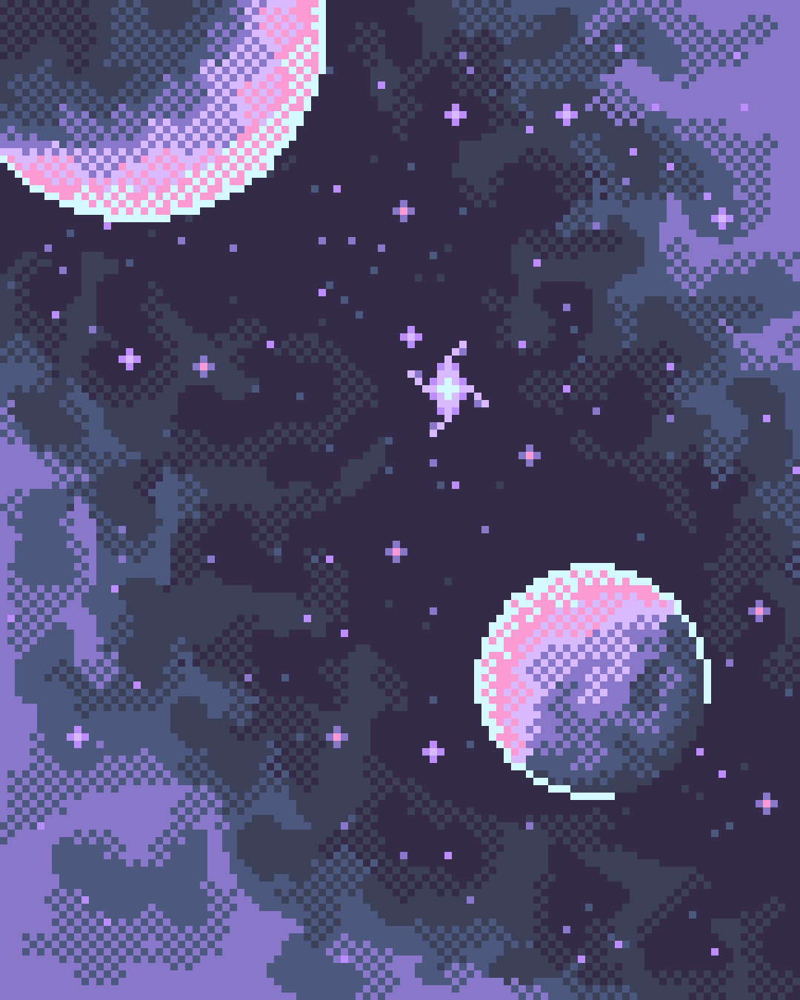

# yyan0155_9103_tut6_groupC_Major project_individual task

## Part 1 : How to start it？

> Here's the **original** image.

>

- *press the “space bar”.*
- When you press the space bar, the image will switch to a mosaic style and begin rotating.

> Here's the **mosaic** mode.

>

- *press the “S key”.*
- When you press the S key, you can summon 1-2 small spaceships randomly. You can continue to summon and stack them.

>

## Part 2 : Details of my individual approach to animating the group code.

- I chose **User Input** to drive my personal code, allowing users to interact with the image using keyboard buttons.
1. I attempted to transform the original image display by changing from conventional geometric shapes to a mosaic style, giving it more vibrancy and a modern feel. The mosaic, composed of small blocks, also brings a unique texture, potentially creating a novel visual experience. 
2. By adding rotation, I introduced dynamism to the image. 
3. The inclusion of small spaceship components adds interactivity and fun, making the scene more engaging and narrative-driven.

## Part 3 : What's my inspiration?

> Here's my inspiration source.
>
- I love playing pixel games because pixel art provides a unique visual experience, with a delicate, cute, and interesting feel. It makes me feel like the pixel world is a miniature, virtual universe. Therefore, I chose a space-themed pixel artwork as my source of inspiration.
- In my individual section, I aim to depict a pixelated miniature universe. The stars revolve around the center of the galaxy, while users can summon small spaceships to embark on adventures in space.

## Part 4 : Brief technical note.
