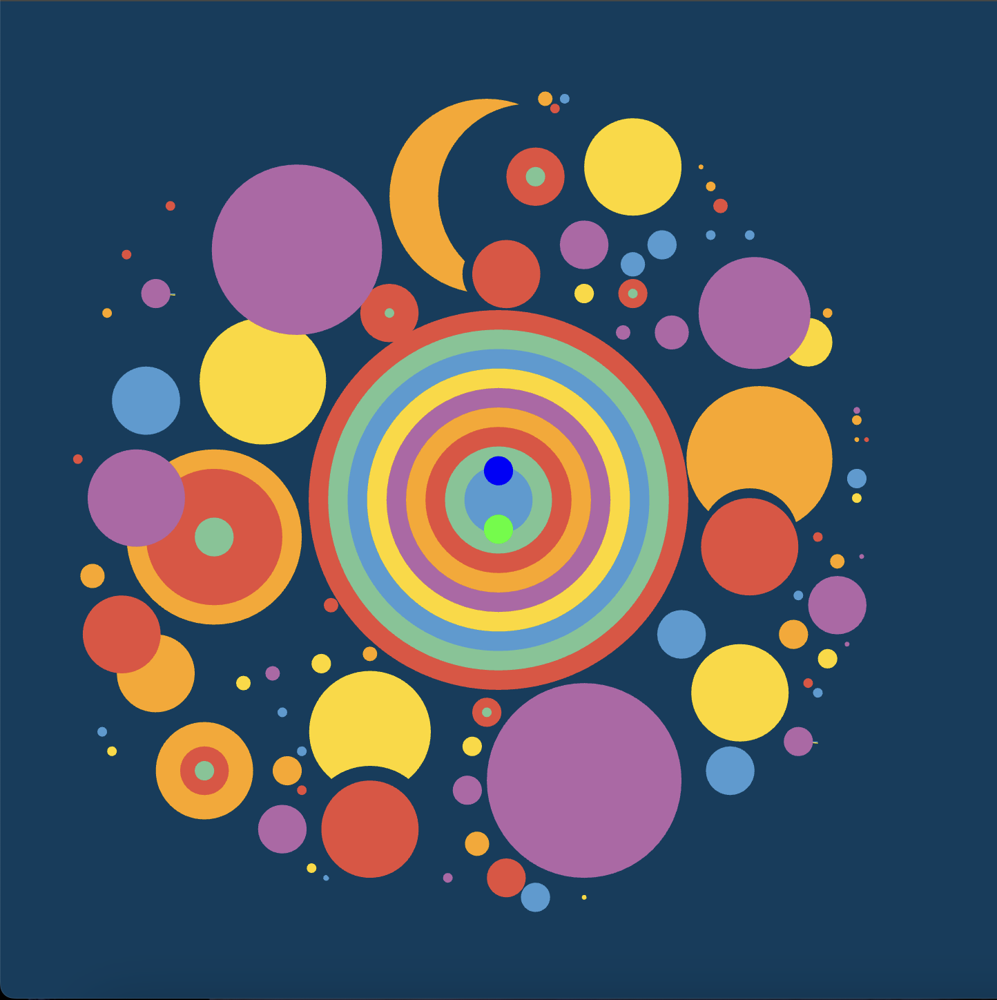
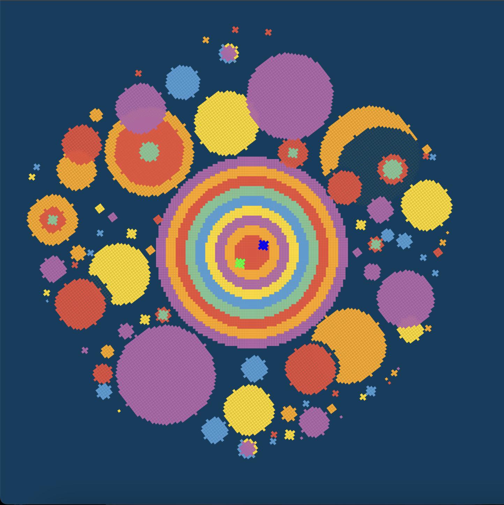
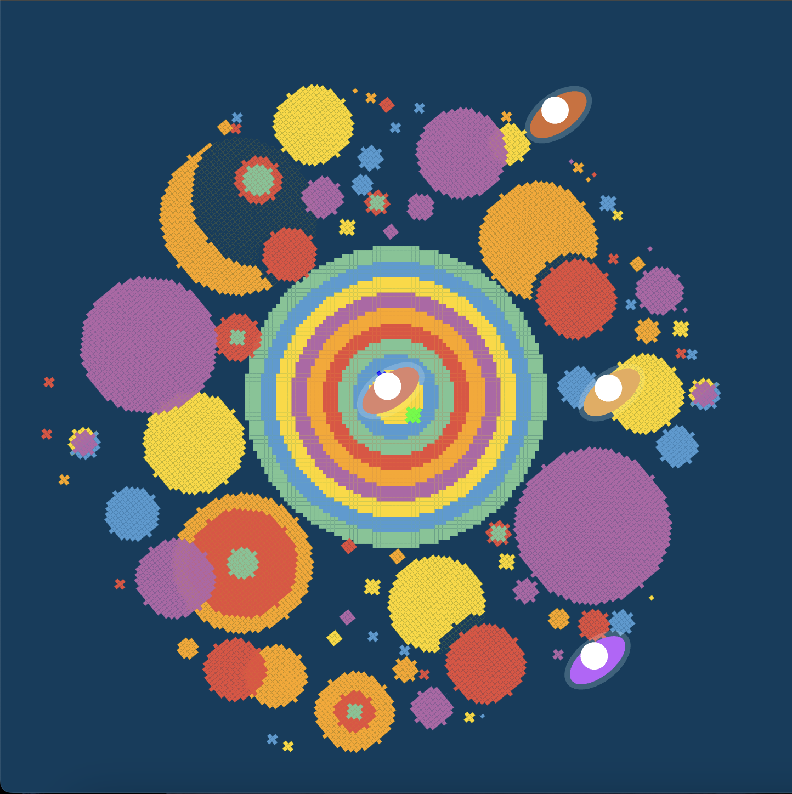

# yyan0155_9103_tut6_groupC_Major project_individual task

## Part 1 : How to start it？

> Here's the **original** image.

>

- *press the “space bar”.*
- When you press the space bar, the image will switch to a mosaic style and begin rotating.

> Here's the **mosaic** mode.

>

- *press the “S key”.*
- When you press the S key, you can summon 1-2 small spaceships randomly. You can continue to summon and stack them.

>

## Part 2 : Details of my individual approach to animating the group code.
kki